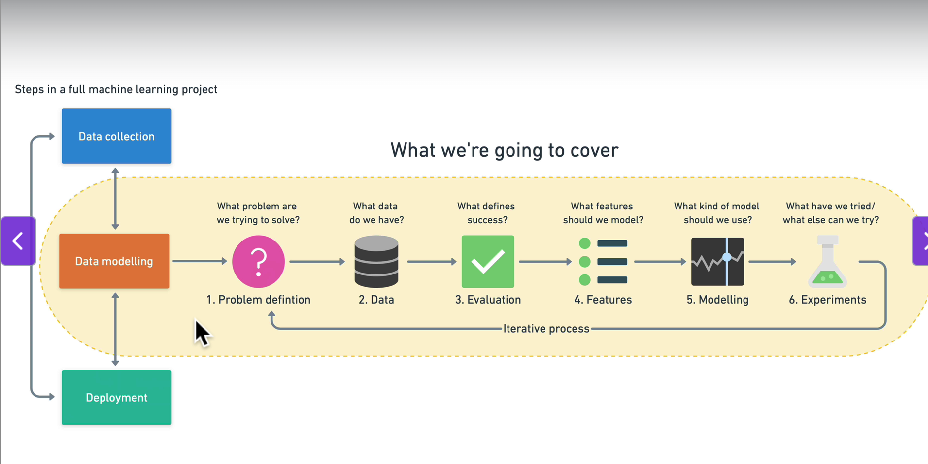

## What's Machine Learning?
The goal of machine learning is to make machines act more and more like humans, because the smarter they get, the more they help us humans accomplish our goals.

<An AI is  a machine that acts like a human. And currently in our industry, we have something called narrow A.I. that is, machines can be just as good or even better than humans at specific tasks. Example: detecting heart disease from mages or at a game of go or chess>

<machine learning is a subset of AI, machine learning is an approach to try  and achieve artificial intelligence through systems that can find patterns in a set of data.>

<Deep Learning : Deep Learning or deep neural networks is just one of the technique to implement machine learning.>

<Data Science: The field of data science simply means analyzing data, looking at data, and then doing something with it , usually some sort of business goal.>

// So when we talk  about machine learning, there's a lot of overlap with data science.

## Link: https://zerotomastery.io/

## Link: https://teachablemachine.withgoogle.com/

## Link: https://ml-playground.com/

Excel Files: can store data businesses generate such as maybe customer data into Excel sheets.

MySQL : allowed us,instead of using spread sheets, to use a language called SQL, to read information from our database, write information to our database, but similar to spreadsheets

spreadsheets --> Relational DB --> "Big Data" NoSQL | mongoDB --> Machine Learning

Machine Learning:
1. Supervised -> Classification, Regression
2. Unsupervised -> Clustering, Association Rule Learning
3. Reinforcement -> Skill acquisition Real time Learning